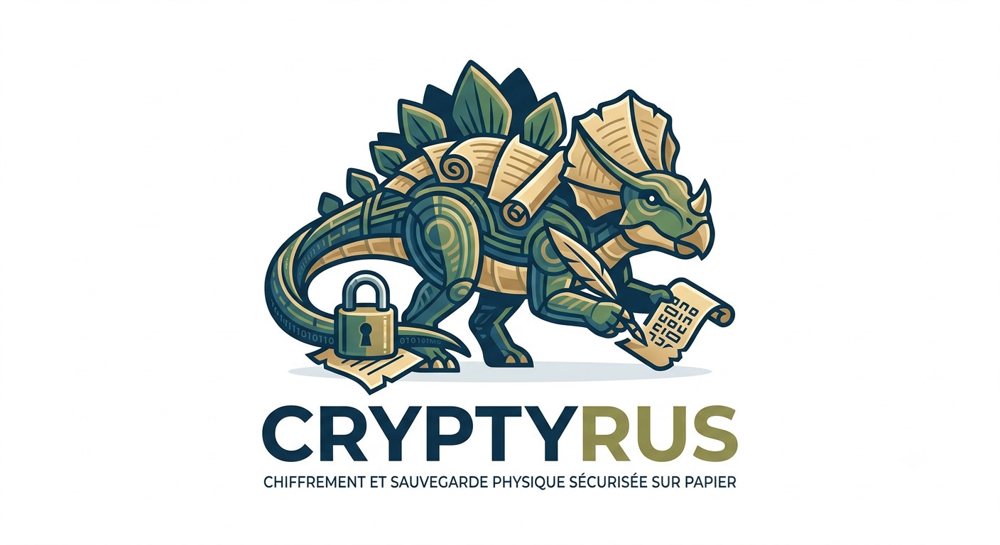

# Cryptyrus

**Chiffrement et sauvegarde physique sécurisée sur papier.**
Tout se passe dans votre navigateur : aucune donnée (secret ou phrase de passe) ne quitte jamais l'appareil.

---

## Présentation

Cryptyrus est une application web **statique et autonome** (une seule page `index.html`) permettant de :

1. **Chiffrer un secret** (mots de passe, clés de récupération, informations sensibles…) et le matérialiser sous forme de **QR code imprimable**, protégé par une **phrase de passe**.
2. **Répartir un secret** sur plusieurs feuilles grâce au **partage de secret de Shamir** (schéma *k-parmi-n*), sans phrase de passe : il faut réunir un nombre minimum de feuilles pour reconstituer le secret.
3. **Récupérer un secret** en scannant un QR code (caméra) ou en collant les données manuellement.

Chaque feuille imprimée embarque également un **programme de récupération autonome** (HTML/JS auto-suffisant) permettant de retrouver le secret même sans accès à Cryptyrus, simplement en ouvrant le fichier dans un navigateur.

---

## Fonctionnalités

- **Chiffrement fort** : AES‑256‑GCM, dérivation de clé PBKDF2‑SHA‑256 (600 000 itérations).
- **Partage de secret de Shamir** (GF(2⁸)) pour une répartition en *k parmi n* feuilles, sans mot de passe.
- **Scan de QR code** via caméra (nécessite HTTPS) ou saisie manuelle des données.
- **Estimateur d'entropie** de la phrase de passe avec estimation du temps de cassage.
- **Contrôle de taille du secret** (512 octets recommandés, 1600 octets maximum) avec compteur en temps réel.
- **Mise en page d'impression dédiée** (une feuille A4 par QR code), avec code de récupération autonome et checksum de contrôle.
- **Thème clair / sombre** (mémorisé localement).
- **Multilingue** : anglais embarqué par défaut, avec packs de langues additionnels (français, allemand, néerlandais, espagnol) chargés dynamiquement.
- **Confidentialité par conception** : Content-Security-Policy stricte (`connect-src 'none'`), aucune requête réseau, aucune donnée transmise.

---

## Structure du projet

```
.
├── index.html              # Application principale (interface + logique)
├── qrcode.min.js            # Bibliothèque de génération de QR codes (locale)
├── html5-qrcode.min.js       # Bibliothèque de scan de QR codes via caméra (locale)
└── lang/                    # (optionnel) Packs de traduction
    ├── fr.js
    ├── de.js
    ├── nl.js
    └── es.js
```

> Les fichiers `qrcode.min.js` et `html5-qrcode.min.js` doivent être présents **dans le même dossier** que `index.html` : l'application ne charge aucune dépendance distante (CSP `script-src 'self'`).

---

## Utilisation

1. Placez `index.html`, `qrcode.min.js` et `html5-qrcode.min.js` dans un même dossier (ajoutez éventuellement le dossier `lang/` pour les traductions).
2. Ouvrez `index.html` dans un navigateur récent (idéalement servi en **HTTPS** si vous souhaitez utiliser le scan par caméra).
3. Choisissez un onglet :
   - **Feuille unique** : saisissez un libellé, le secret à protéger et une phrase de passe, puis générez et imprimez la feuille.
   - **Répartition sur plusieurs feuilles** : définissez le nombre total de feuilles et le seuil requis, puis générez et imprimez les feuilles (à conserver dans des lieux distincts).
   - **Récupérer un secret** : scannez ou collez les données d'une (ou plusieurs) feuille(s), puis saisissez la phrase de passe si nécessaire.

---

## Déploiement

L'application est purement statique (HTML/CSS/JS), elle peut être servie par n'importe quel serveur web (Nginx, Apache, BusyBox httpd, etc.) ou hébergée en ligne. Le scan de QR code par caméra nécessite un contexte sécurisé (**HTTPS**) ; sans cela, la saisie manuelle des données reste disponible.

Le projet inclut un `Dockerfile` minimaliste basé sur `busybox`, qui sert les fichiers statiques via `busybox httpd` sous un utilisateur non‑root.

```yaml
services:
  cryptyrus:
    image: ghcr.io/debben80/cryptyrus:latest
    container_name: cryptyrus
    restart: unless-stopped
    ports:
      - "8080:8080"
    read_only: true
```

---

## Sécurité

- **Feuille unique** : AES‑256‑GCM + PBKDF2 (SHA‑256, 600 000 itérations) — la phrase de passe est l'unique protection du secret.
- **Répartition Shamir** : aucune phrase de passe n'est nécessaire, la sécurité repose sur la séparation physique des feuilles ; une seule feuille ne révèle rien.
- Un **checksum** (empreinte SHA‑256 tronquée) est imprimé sur chaque feuille afin de vérifier qu'elle a été recopiée sans erreur — il ne permet en aucun cas de retrouver le secret.

---
